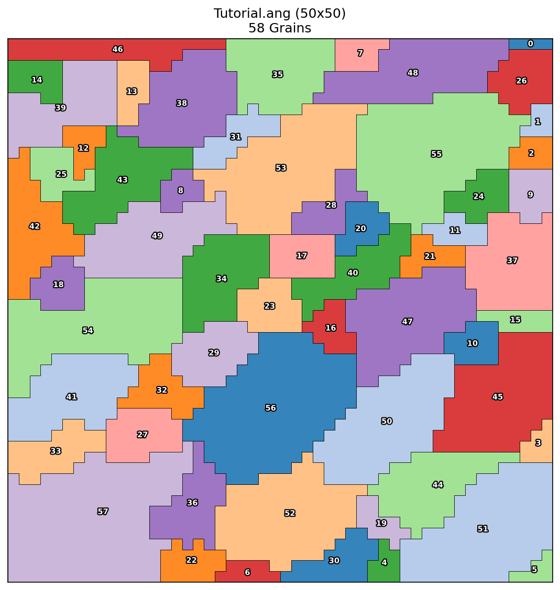
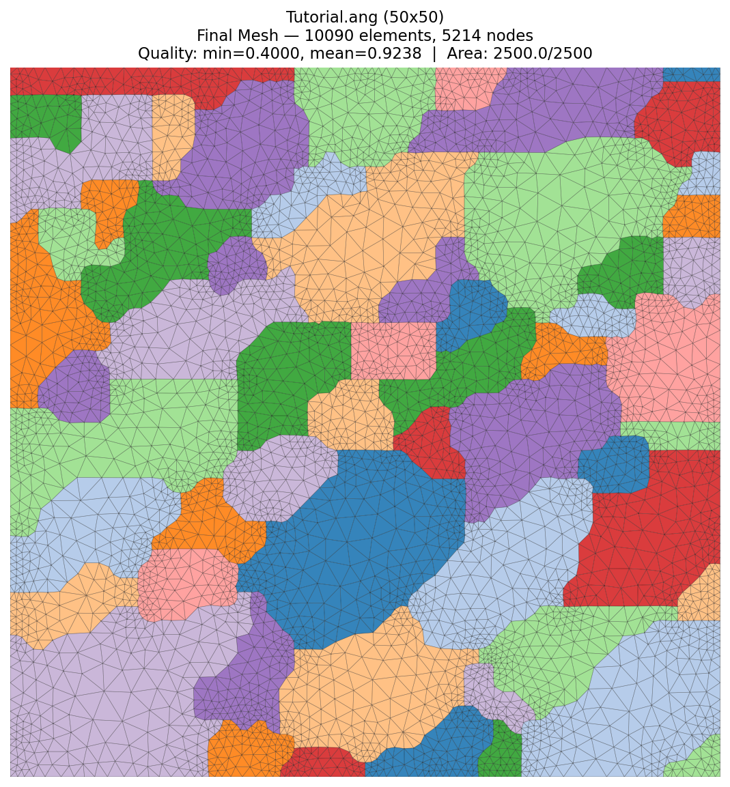
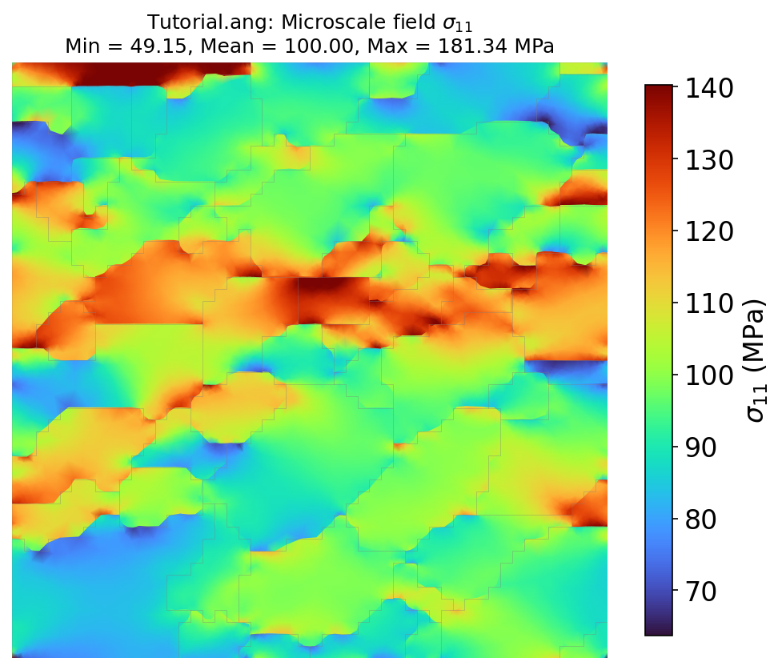
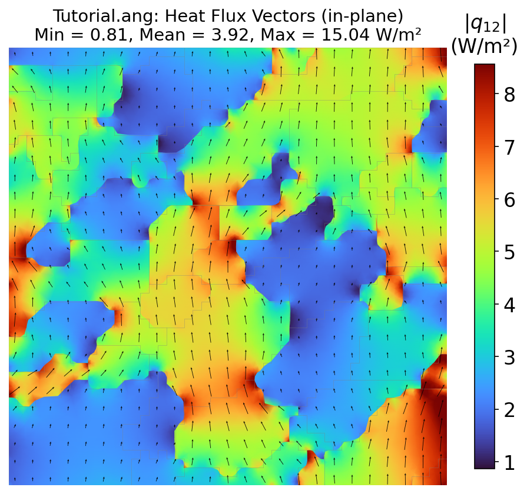
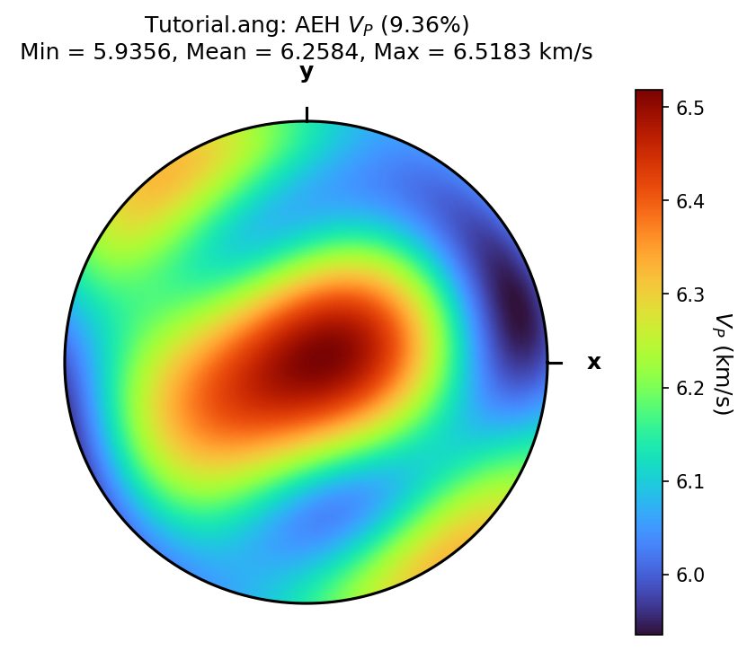
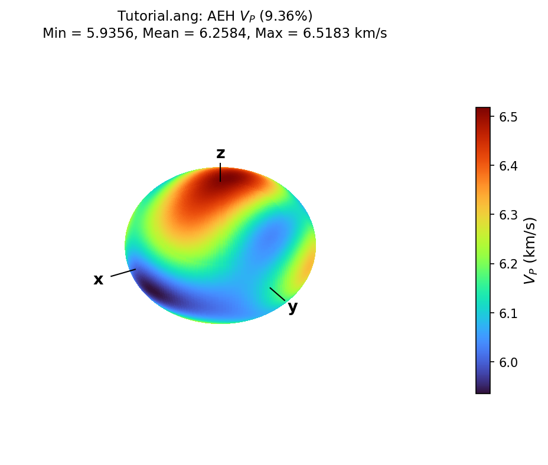

# TESA Toolbox

**Thermal and Elastic Scale-bridging Analysis of Polycrystalline Microstructures**

**Authors:** Alden C. Cook<sup>1</sup>, Senthil S. Vel<sup>1</sup>, Scott Johnson<sup>2</sup>, Chris Gerbi<sup>2</sup>, and Won Joon Song<sup>2</sup>

<sup>1</sup> Department of Mechanical Engineering, University of Maine, Orono, Maine 04469

<sup>2</sup> School of Earth and Climate Sciences, University of Maine, Orono, Maine 04469

TESA Toolbox is a Python-based computational tool for evaluating the effective (homogenized) thermo-elastic and thermal transport properties of polycrystalline materials directly from EBSD (Electron Backscatter Diffraction) microstructure data. It uses the **Asymptotic Expansion Homogenization (AEH)** finite element method to bridge the gap between single-crystal properties and bulk polycrystalline behavior.

<p align="center">
  
  
</p>
<p align="center">
  
  
</p>
<p align="center">
  
  
</p>

**New to TESA?** See the **[Tutorial](docs/Tutorial.md)** for a step-by-step walkthrough using the included sample data.

## What TESA Does

Given an EBSD map and crystal phase property files, TESA:

1. **Parses the microstructure** — identifies grains, phases, and crystallographic orientations
2. **Generates a finite element mesh** — conforming to grain boundaries with adaptive refinement
3. **Solves the AEH homogenization problem** — computes characteristic functions on the periodic unit cell
4. **Extracts effective properties** — elastic stiffness, thermal expansion, thermal conductivity, wave speeds
5. **Evaluates microscale fields** — stress, strain, heat flux, and temperature gradient distributions under applied loading

## Pipeline Overview

TESA runs a 4-stage pipeline configured through a single Python script (`run_tesa.py`):

| Stage | Description | Output |
|-------|-------------|--------|
| **Stage 1** | Load EBSD data + phase properties | Grain maps, Euler angles, phase identification |
| **Stage 2** | Generate finite element mesh | Conforming or non-conforming triangular mesh |
| **Stage 3** | AEH-FE solver | Effective C, alpha, kappa + VRH/Hill/Geometric bounds |
| **Stage 4** | Post-processing | Field plots, property files, analysis log |

## Mesh Types

| Type | Description | Best for |
|------|-------------|----------|
| **Type 1** | Conforming non-uniform — adapts to grain boundaries with curvature-based refinement | Accurate grain boundary resolution, field discontinuities |
| **Type 2** | Non-conforming hexagonal grid | Fast meshing, large maps |
| **Type 3** | Non-conforming rectangular grid | Fastest meshing, parametric studies |

## Supported Properties

TESA can compute the following effective properties from EBSD data:

- **Elastic stiffness tensor** (full 6x6 C_ij)
- **Thermal expansion tensor** (6-component alpha)
- **Thermal conductivity tensor** (3x3 kappa)
- **Wave speeds** (phase velocities as a function of propagation direction)
- **Voigt, Reuss, Hill, and Geometric Mean bounds** for all properties

Microscale field outputs include:
- **Stress and strain fields** under applied mechanical loading or thermal loading
- **Heat flux and temperature gradient fields** under applied temperature gradient

## Input Data

### EBSD Files

TESA reads standard EBSD formats:
- `.ang` (TSL/EDAX OIM)
- `.txt` (generic tab-delimited with Euler angles and coordinates)

### Crystal Phase Property Files

Material properties are specified in text files using an Abaqus-style `*keyword` format:

```
*phase
alpha-Quartz

*density
2650.0

*stiffness_matrix
88.2    6.5    12.4    18.8     0.0     0.0
 6.5   88.2    12.4   -18.8     0.0     0.0
12.4   12.4   107.2     0.0     0.0     0.0
18.8  -18.8     0.0    58.5     0.0     0.0
 0.0    0.0     0.0     0.0    58.5    18.8
 0.0    0.0     0.0     0.0    18.8    40.9

*thermal_expansion
5.35e-05
5.35e-05
2.72e-05
0.0
0.0
0.0

*thermal_conductivity
6.15    0.0     0.0
0.0     6.15    0.0
0.0     0.0     10.17
```

Property files for common minerals are included in `property_files/`.

## Project Structure

```
run_tesa.py              # Main script — configure jobs and settings here
tesa/                    # Python package (all library code)
EBSD_maps/               # Input EBSD data files
property_files/          # Crystal phase property files
results/                 # Output (one folder per EBSD map, with study subfolders)
docs/                    # Documentation and tutorial
```

## Requirements

- Python 3.9+
- NumPy
- SciPy
- Matplotlib
- Shapely

## Getting Started

1. Clone the repository
2. Install dependencies: `pip install -r requirements.txt`
3. Edit `run_tesa.py` to configure your EBSD file, phase properties, and analysis settings
4. Run the pipeline:
   ```
   python run_tesa.py
   ```
   (Use `python3 run_tesa.py` if your system requires it.)
5. Results are saved to `results/{ebsd_name}/`

For a detailed walkthrough of all settings and sample output, see the **[Tutorial](docs/Tutorial.md)**.

## References

The AEH method implemented in TESA is based on:

- Vel, S.S., Cook, A.C., Johnson, S.E., and Gerbi, C. (2016). "Computational homogenization and micromechanical analysis of textured polycrystalline materials." *Computer Methods in Applied Mechanics and Engineering*, 310, 749-779. [doi:10.1016/j.cma.2016.07.037](https://doi.org/10.1016/j.cma.2016.07.037)

## License

This project is licensed under the [MIT License](LICENSE).
